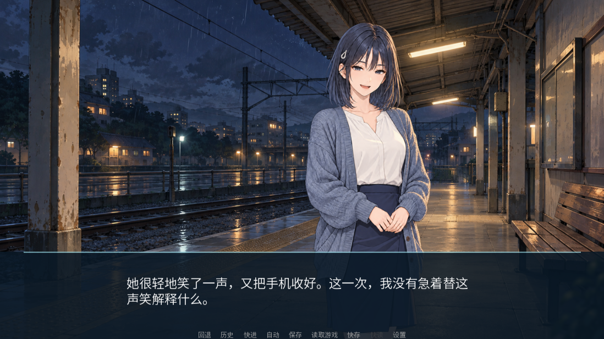

# 雨停之前 / Before the Rain Stops

一部可离线游玩的中文 Ren'Py 视觉小说。雨夜的旧车站，两位久未联系的旧友，和一封没有寄出的信。

main 当前为 **v0.9.0 原生 1080p 体验候选开发中**：六章、24 个叙事场景与 2 个状态路由、4 次关键选择、16 条路线、Normal / True 两个完整候选结局。包含七种女主表情、雨夜站台与新增三个场景背景、旧信 CG、17 句 AI 关键语音、3 首原创程序音乐、两种雨声和纸张／消息音效。主题、成年女主许澄和画风仍待用户最终审阅。

正文全分支 15,206 字符，单路线 11,404–11,744 字符（包含标点，菜单单列）。仅文字阅读按每分钟 250–350 字符估算约 32–47 分钟；真人完整阅读、听感与普通电脑试玩尚未验收。统计见 [路线报告](docs/STORY_STATS_V07.md)。

原生画布 1920×1080，默认 1280×720 缩放窗口。当前 Windows 候选验收后更新下载入口；见 [适配说明](docs/DISPLAY_V09.md)。

## 下载与运行

[Windows 发布版本](https://github.com/AureliusWu/Test/releases) · [构建与运行证据](https://github.com/AureliusWu/Test/actions) · [阶段记录](docs/STATUS.md)

最新公开 Release 仍为 v0.6.0。上一份已验收的 v0.8.0 完整候选的 [Windows 验收 37281855516](https://github.com/AureliusWu/Test/actions/runs/37281855516) 已通过：79 Python；源码与独立 EXE 各 30/345，重新启动后读档另 1/10，失败和跳过为 0；109 张证据 PNG 完整解码。

[下载 v0.8 Windows 候选 artifact](https://github.com/AureliusWu/Test/actions/runs/37281855516/artifacts/11333430981) · [Beta 验收](docs/BETA_ACCEPTANCE_V08.md) · [统一真人后续清单](docs/HUMAN_HANDOFF.md)。Actions 需登录，保留至 2027-01-03；同字节试玩 ZIP、校验和、实际预览与统一审阅包另已交付。游戏 ZIP 为 44,868,967 字节，SHA-256 `e436d30a93e7a51671b4ffec60a43ff636a865299b67f237af1c8195e048ba9c`。候选交付与公开 Release 分别报告。

1. 下载并解开 Windows artifact 外层，再完整解压 `BeforeTheRainStops-0.8.0-win.zip`；或从 Release 下载现有 v0.6.0。
2. 完整解压到可写目录。不要直接在 ZIP 内启动。
3. 双击 `BeforeTheRainStops.exe`，选择“开始游戏”。无需安装 Python、Ren'Py 或模型，无需联网。

左键、空格或 Enter 推进；右键或 Esc 打开菜单。画面下方可存档、读档、查看历史、快进、自动播放和进入设置。设置含音量、文字速度与全屏/窗口切换。结局页可返回主菜单，再从头走另一条路线。

各阶段使用独立存档目录；旧存档保留，不跨版本加载。v0.1 是可运行的临时资产测试片段，不计入正式剧情。



## 开发与验证

普通校验依赖 Python 3.12、Pillow 和 SoundFile／NumPy；配音模型与 FFmpeg 仅用于资产制作，全部开发依赖不进入玩家包。

```bash
python -m pip install -r requirements-dev.txt
python -m tools.prompt_registry --check
python -m tools.image_process.import_asset --check
python -m tools.audio_validator --report reports/audio.json
python -m tools.compile_story
python -m tools.compile_tests
python -m tools.story_stats --markdown reports/story-stats.md
python -m tools.validate
python -m tools.build.sdk
```

SDK 固定为 Ren'Py 8.5.3，下载后校验官方包 SHA-256。在 Windows 上执行：

```powershell
$sdk = ".runtime/renpy-8.5.3-sdk"
& "$sdk/lib/py3-windows-x86_64/python.exe" "$sdk/renpy.py" . lint --error-code --all-problems
python -m tools.build.display
python -m tools.build.verify_package --source-sdk $sdk --timeout 2400
python -m tools.build.package --sdk $sdk
python -m tools.build.verify_package --zip dist/BeforeTheRainStops-0.9.0-win.zip --timeout 2400
```

Linux/macOS 可用 SDK 的 `renpy.sh` 运行 lint/test。Linux 无桌面时需要 Xvfb。Windows Actions 先做数据校验与原生交互测试，再构建 ZIP，直接启动解压后的独立 EXE 重跑测试。main 成功后仅上传候选与证据，附 SHA256SUMS；手动发布入口重验选定提交和版本后才创建预发行 Release。

## 数据与资产

| 位置 | 用途 |
|---|---|
| `game/data/story.json` | 场景、台词 ID、选择、状态与结局的事实来源 |
| `game/script/*_generated.rpy` | 编译成原生 label/menu/if 的产物 |
| `game/data/asset_manifest.json` | 文件、来源、许可、版本、Prompt 与哈希 |
| `game/data/voice_manifest.json` | 台词文本、声音配置、时长与语音文件绑定 |
| `assets_source/` | 原始图片、源 WAV 和 UI 图元 |
| `game/` | 游戏实际使用的尺寸与格式 |
| `prompts/registry.json`、`prompts/` | 69 份版本化请求、稳定 ID、共享组件与 SHA-256 |
| `tools/`、`tests/` | 资产处理、编译、路线与完整性校验 |

仅三个剧情状态：affection、trust、truth_known。模型不进入游戏；运行时没有 LLM、TTS 服务或服务器。Prompt 与文件一起进 Git，修改语音文字后必须重新生成。文档见 [项目约束](docs/PROJECT.md)、[AI 流程](docs/AI_PIPELINE.md)、[测试计划](docs/TEST_PLAN.md) 和 [资产署名](CREDITS.md)。

## 资产流程与下一阶段

69 份 Prompt、85 个资产、60 张 PNG 与 60 个图片重建配方可追踪。图片导入包含预检、dry-run、版本与路径检查、正常 I/O 失败回滚和重复执行检查，详见 [v0.5 资产操作文档](docs/ASSET_PIPELINE_V05.md) 与 [v0.7 场景候选](docs/ART_REVIEW_V07.md)。

v0.6 新增 11 句配音与 5 个程序音频，17 句合计 58.048 秒。音乐随旧信、回忆和离站切换，雨声逐渐减弱并在剧情指定台词处淡出。24 个游戏音频及源 WAV 均完整解码并测量；重复执行制作工具保留已有文件。流程、接入位置和试听范围见 [v0.6 音频操作文档](docs/AUDIO_V06.md)。

六章、16 条路线及两个结局已完成 Alpha 正文，说明见 [场景 Outline](docs/STORY_OUTLINE_V07.md) 与 [路线审阅](docs/STORY_REVIEW_V07.md)。v0.7 候选技术验收已完成，v0.8 已补后半段存读档、回退改选、连续结局、自动语音衔接与重新启动 EXE 后读档，已通过 Windows 源码和独立 EXE 验收，结果见 [Beta 验收](docs/BETA_ACCEPTANCE_V08.md)。真人计时、试听、创作审阅和普通电脑试玩由用户后续统一完成，见 [后续清单](docs/HUMAN_HANDOFF.md)。重大剧情和最终美术继续由用户决定。大系统保持在 [Future Ideas](docs/FUTURE_IDEAS.md)。

[版本路线](ROADMAP.md) 与 [v0.7–v1.0 执行计划](docs/RELEASE_PLAN_V07_V10.md) 列出完整剧情、回归加固、1080p 适配和正式发布的范围、依赖与验收。[v0.6.0 已发布](https://github.com/AureliusWu/Test/releases/tag/v0.6.0)：Windows 源码和独立 EXE 各通过 24 个用例 / 151 个断言，无失败或跳过。

按 v0.1–v1.0 的 10 个发布里程碑统计，已完成 6 个，当前进度为 **60%**。此比例只统计版本节点，不代表工时或最终内容的完成比例；v0.7 / v0.8 技术验收已完成，v0.9 / v1.0 与真人事项继续后续。
