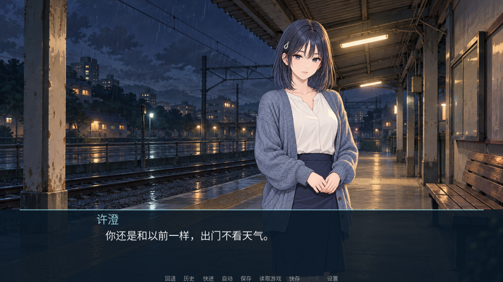

# 雨停之前 / Before the Rain Stops

一部可离线游玩的中文 Ren'Py 视觉小说。雨夜的旧车站，两位久未联系的旧友，和一封没有寄出的信。

当前为 **v0.2.0 Vertical Slice**：8 个场景、3 次关键选择、Normal / True 两个片段结局，包含 AI 女主立绘、雨夜背景、关键 CG、6 句 AI 语音、原创音乐与雨声。主题、成年女主许澄和画风为待用户审阅的创作方案。

单路线约 1,740–1,900 汉字。按每分钟 250–350 汉字、另计选择和画面停留，预估 6–9 分钟；尚未经过真人计时。完整 30–60 分钟作品属于后续版本。

## 下载与运行

[Windows 发布版本](https://github.com/AureliusWu/Test/releases) · [构建与运行证据](https://github.com/AureliusWu/Test/actions) · [阶段记录](docs/STATUS.md)

1. 下载 Release 中的 `BeforeTheRainStops-0.2.0-win.zip`。
2. 完整解压到可写目录。不要直接在 ZIP 内启动。
3. 双击 `BeforeTheRainStops.exe`，选择“开始游戏”。无需安装 Python、Ren'Py 或模型，无需联网。

左键、空格或 Enter 推进；右键或 Esc 打开菜单。画面下方可存档、读档、查看历史、快进、自动播放和进入设置。设置含音量、文字速度与全屏/窗口切换。结局页可返回主菜单，再从头走另一条路线。

v0.1 工程片段与 v0.2 使用不同存档目录；旧存档保留，但不跨版本加载。v0.1 是可运行的临时资产测试片段，不计入正式剧情。



## 开发与验证

普通校验只依赖 Python 3.12 和 Pillow；配音模型与 FFmpeg 仅用于资产制作。

```bash
python -m pip install -r requirements-dev.txt
python -m tools.compile_story
python -m tools.compile_tests
python -m tools.validate
python -m tools.build.sdk
```

SDK 固定为 Ren'Py 8.5.3，下载后校验官方包 SHA-256。在 Windows 上执行：

```powershell
$sdk = ".runtime/renpy-8.5.3-sdk"
& "$sdk/lib/py3-windows-x86_64/python.exe" "$sdk/renpy.py" . lint --error-code --all-problems
& "$sdk/lib/py3-windows-x86_64/python.exe" "$sdk/renpy.py" . test global --report-detailed --overwrite-screenshots
python -m tools.build.package --sdk $sdk
python -m tools.build.verify_package --zip dist/BeforeTheRainStops-0.2.0-win.zip
```

Linux/macOS 可用 SDK 的 `renpy.sh` 运行 lint/test。Linux 无桌面时需要 Xvfb。Windows Actions 先做数据校验与原生交互测试，再构建 ZIP，直接启动解压后的独立 EXE 重跑测试。测试通过才发布预发行版本，附 SHA256SUMS。

## 数据与资产

| 位置 | 用途 |
|---|---|
| `game/data/story.json` | 场景、台词 ID、选择、状态与结局的事实来源 |
| `game/script/*_generated.rpy` | 编译成原生 label/menu/if 的产物 |
| `game/data/asset_manifest.json` | 文件、来源、许可、版本、Prompt 与哈希 |
| `game/data/voice_manifest.json` | 台词文本、声音配置、时长与语音文件绑定 |
| `assets_source/` | 原始图片、源 WAV 和 UI 图元 |
| `game/` | 游戏实际使用的尺寸与格式 |
| `prompts/` | 可追踪的角色、场景、美术与声音提示 |
| `tools/`、`tests/` | 资产处理、编译、路线与完整性校验 |

仅三个剧情状态：affection、trust、truth_known。模型不进入游戏；运行时没有 LLM、TTS 服务或服务器。Prompt 与文件一起进 Git，修改语音文字后必须重新生成。文档见 [项目约束](docs/PROJECT.md)、[AI 流程](docs/AI_PIPELINE.md)、[测试计划](docs/TEST_PLAN.md) 和 [资产署名](CREDITS.md)。

## 下一阶段

先试玩样片并确认主题、女主、画风与结局方向，再制作至少五种一致表情和扩展完整路线。大系统保持在 [Future Ideas](docs/FUTURE_IDEAS.md)。
