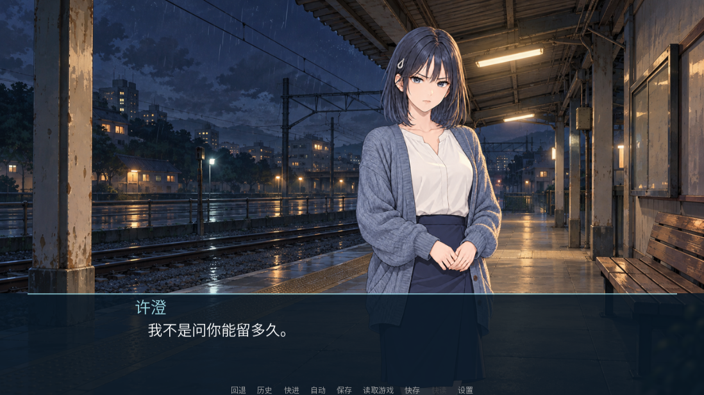

# v0.3 表情审阅记录

用户授权沿用候选许澄形象继续角色阶段。六次编辑均通过内置 imagegen，输入同一张 `assets_source/character/heroine_clean_v2.png`；原有 normal 保留。最终视觉选择待用户审阅。

## 实际资产与固定 Prompt

| 表情 | 游戏文件 | 精确 Prompt | 首次显示 | 轮廓 IoU | 包围盒偏差 |
|---|---|---|---|---|---|
| normal / 平静 | [characters/heroine_normal.png](../game/characters/heroine_normal.png) | [heroine_clean_v2.md](../prompts/character/heroine_clean_v2.md) | s01_arrival_l001 | 1.00000 | 0 px |
| smile / 微笑 | [characters/heroine_smile_v1.png](../game/characters/heroine_smile_v1.png) | [heroine_smile_v1.md](../prompts/character/heroine_smile_v1.md) | s01_arrival_l005 | 0.99429 | 1 px |
| happy / 开心 | [characters/heroine_happy_v1.png](../game/characters/heroine_happy_v1.png) | [heroine_happy_v1.md](../prompts/character/heroine_happy_v1.md) | s04_waiting_l022 | 0.99621 | 1 px |
| sad / 难过 | [characters/heroine_sad_v1.png](../game/characters/heroine_sad_v1.png) | [heroine_sad_v1.md](../prompts/character/heroine_sad_v1.md) | s04_waiting_l002 | 0.99305 | 1 px |
| angry / 生气 / 不悦 | [characters/heroine_angry_v1.png](../game/characters/heroine_angry_v1.png) | [heroine_angry_v1.md](../prompts/character/heroine_angry_v1.md) | s04_waiting_l004 | 0.99706 | 0 px |
| surprised / 惊讶 | [characters/heroine_surprised_v1.png](../game/characters/heroine_surprised_v1.png) | [heroine_surprised_v1.md](../prompts/character/heroine_surprised_v1.md) | s04_waiting_l020 | 0.99464 | 1 px |
| embarrassed / 害羞 | [characters/heroine_embarrassed_v1.png](../game/characters/heroine_embarrassed_v1.png) | [heroine_embarrassed_v1.md](../prompts/character/heroine_embarrassed_v1.md) | s02_reunion_l006 | 0.99768 | 0 px |

共享固定组件：[heroine_expressions_v1.json](../prompts/character/heroine_expressions_v1.json)。六张源图位于 `assets_source/character/heroine_<expression>_v1.png`，画布 1024×1536；游戏图统一 540×700。Manifest 记录 Prompt、组件、输入参考图、源图、游戏文件的 SHA-256。生成只改变面部方向，不用程序绘制或拼接表情。

## 审阅与边界

Agent 检查了生成结果和七种实际剧情画面：成年脸型、蓝黑短发、灰蓝眼睛、角色右侧发夹、蓝灰开衫、象牙白上衣、深蓝裙及双手姿势一致；表情足以区分，气质保持克制。细小线条与织纹差异可能存在，几何指标不证明逐像素一致或身份绝对正确。

实际剧情覆盖七种表情；CG 场景清除普通立绘。存档前 normal、存档后强制 angry，再读档，断言恢复 normal。自动测试用于验证显示与恢复，情绪是否贴切仍需玩家审阅。

Windows 源码引擎与独立 EXE 均通过 13 个用例 / 62 个断言；验收证据 SHA-256 已核验，42 张 PNG 完整解码，Agent 直接看过独立 EXE 的七种表情。全部截图保留在对应 Actions 测试证据中；发布验收结果见 [STATUS.md](STATUS.md)。本地截图曾出现截断，独立 EXE 验收已增加完整 PNG 解码检查，文件存在不能单独视为证据通过。
